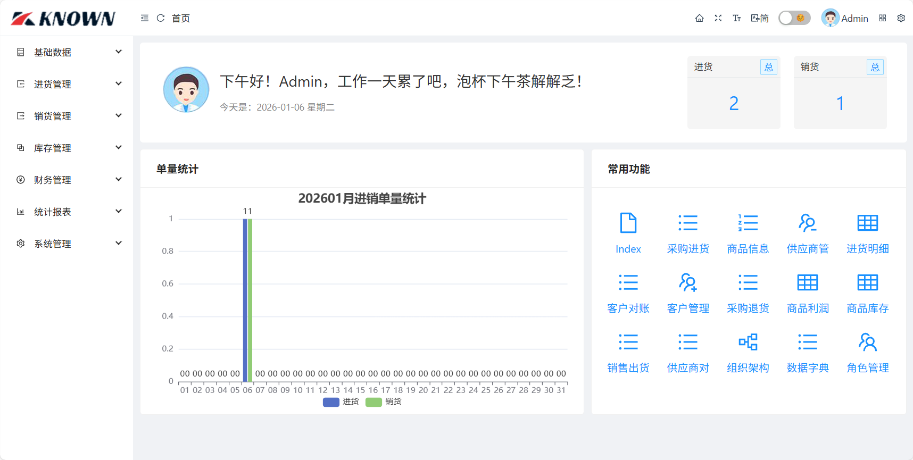

# JxcLite

`JxcLite`是基于`Known`框架开发的简易进销存管理系统项目。

- 框架官网：[https://known.org.cn](https://known.org.cn)
- 项目体验：[https://jxc.known.org.cn](https://jxc.known.org.cn)

## 项目结构

```
├─JxcLite          -> 包含配置、常量、枚举、实体、模型、服务、路由、页面。
├─JxcLite.Web      -> 项目BlazorServer宿主。
├─JxcLite.WinForm  -> 项目WinForm App宿主。
├─JxcLite.sln      -> 项目解决方案文件。
```

## 功能模块

- 基础数据：包含数据字典、组织结构、商品信息、供应商、客户管理。
- 进货管理：包含采购进货单、采购退货单。
- 销货管理：包含销售出货单、销售退货单。
- 库存管理：包含商品库存查询。
- 财务管理：包含客户对账单、供应商对账单、应收账款、应付账款、其他费用。
- 统计报表：包含进货报表、销货报表、库存报表、财务报表。
- 系统管理：包含角色管理、用户管理、系统附件、系统日志。

> 专业版有增值功能（[在线体验](https://jxc.known.org.cn)），如有需要，请联系作者。

## 合作联系

- 联系QQ：65536471
- 微信号：knownchen
- 添加好友请备注来源JxcLite，谢谢！

## 使用说明

- 数据库位置源码跟目录SQLite库`JxcLite.db`
- 登录用户名：Admin，密码：1

## 系统截图



## 捐赠支持

> 如果你觉得这个系统对你有帮助，你可以请作者喝杯咖啡表示鼓励 ☕️


感谢如下捐赠者：

捐赠者|金额|时间|备注
---|---|---|---
广州-陈立志|600|2026-02-28|应收应付、其他费用模块